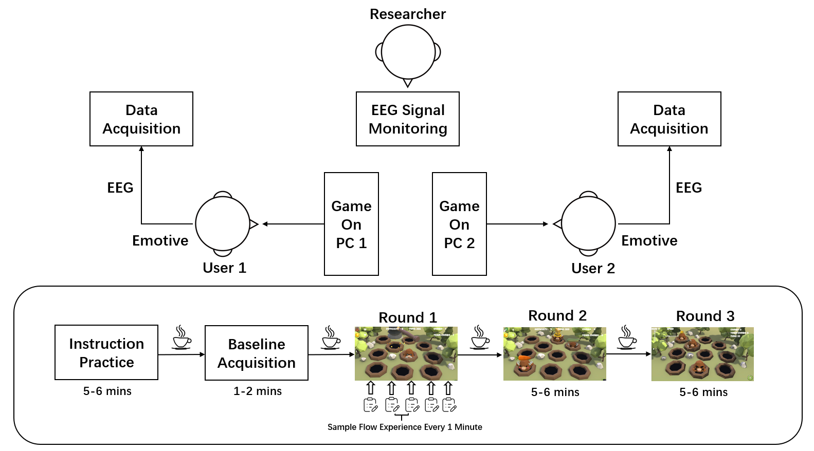
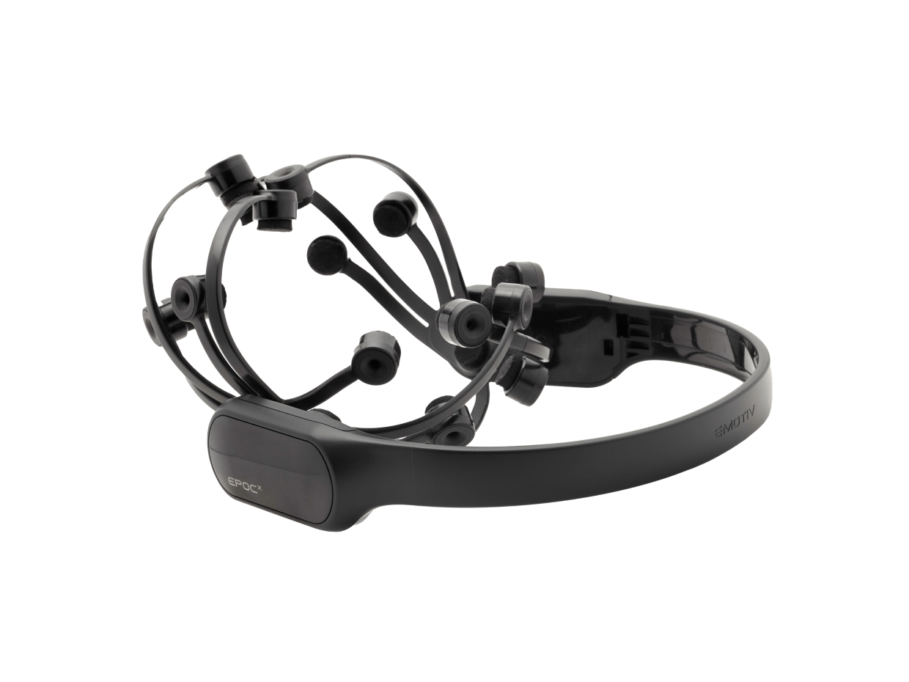

## Dataset
The dataset is about 34.4 GB including multi-EEG signals data of team flow from 52 pairs of participants.

Although 52 pairs of participants participated in the EEG data acquisition, only 47 pairs of them were included in the final dataset after excluding groups with data acquisition errors and operational failures.

 Fig1 Data Acquisition

The EEG recording devices adopted in this study are two sets of Emotiv Epoc+, which supports the acquisition of up to 14 channels of EEG signals at a sampling rate of 256 Hz.

 Fig2 Emotive Epoc+

All data were saved as CSV files, each of which was a matrix of dimensions [14, 1536]. It represents 14-channel EEG data with 1536 sample points, the sampling rate of the EEG signals is 256 Hz,i.e. each CSV file has a duration of 6 seconds.

During the game, the EEG signals collected from each pair of participants were organized by "group number-participant number-game set number". Each participant's folder contains EEG data sliced from five rounds of game. 

Because of the data sharing policy of our group, data of the paper cannot be released here directly. If you are interested in using the data, please contact the authors , to get them for non-commercial use only. Please provide your name, institution, and purpose of using the data, and please cite the paper if you use the data.
